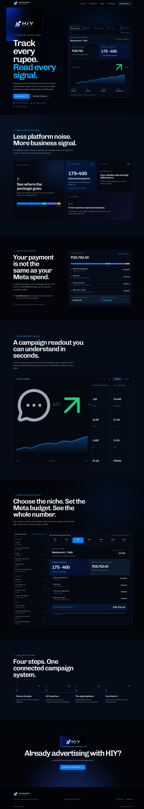
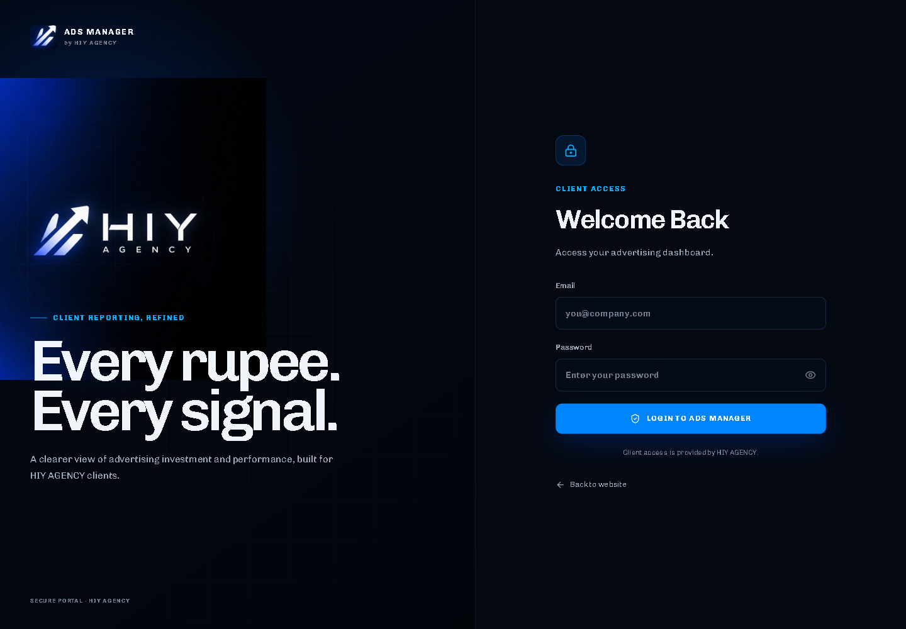
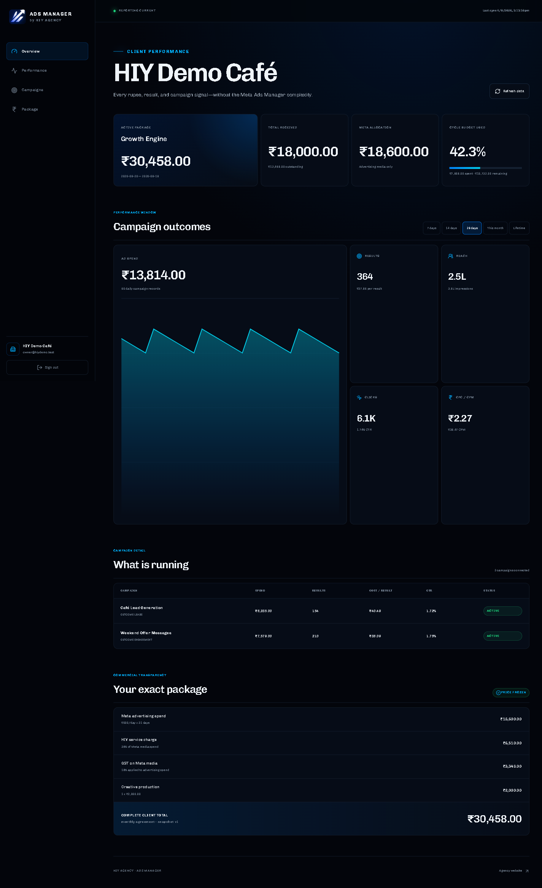
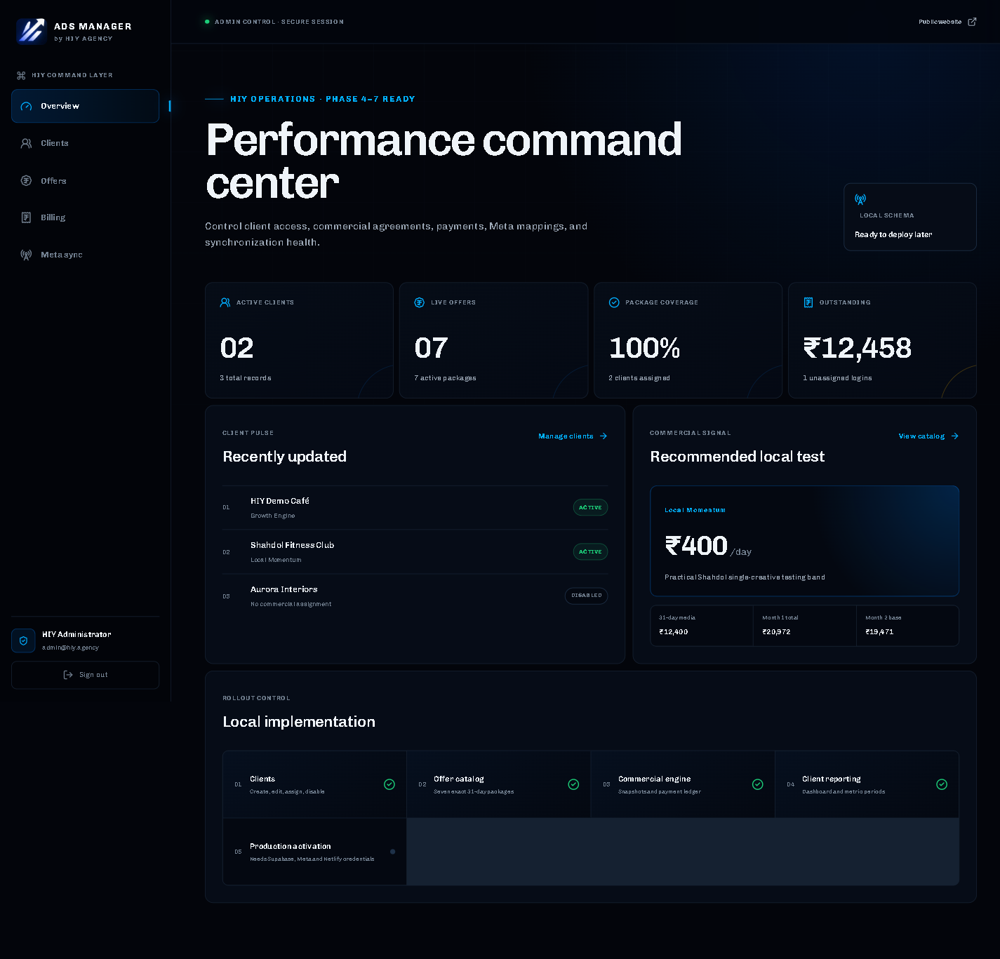
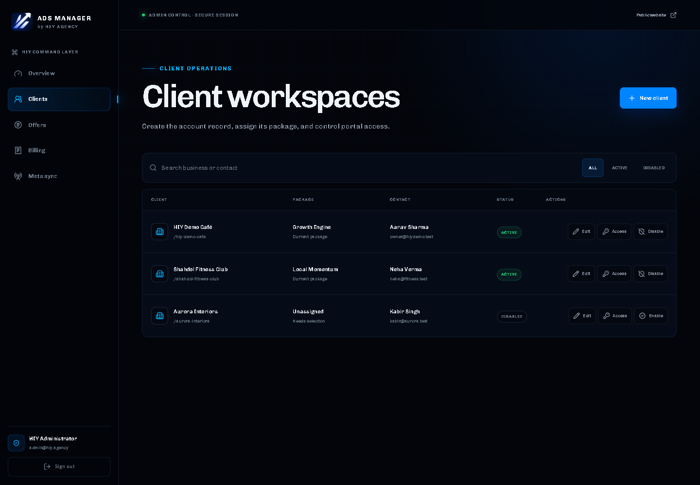
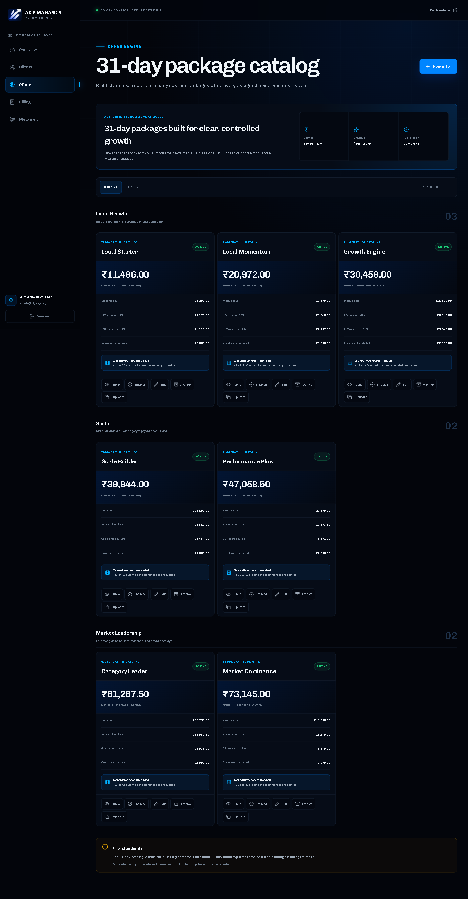
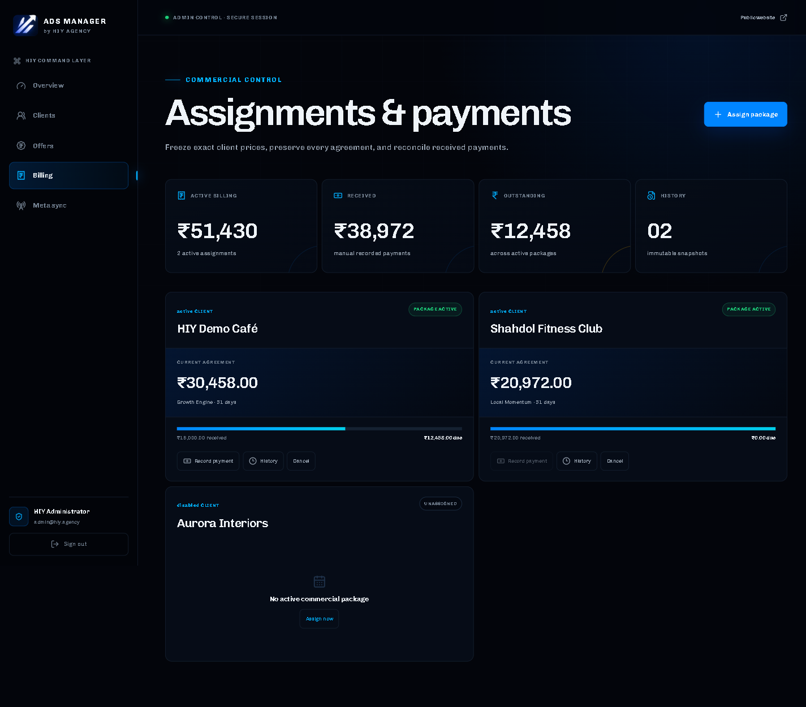
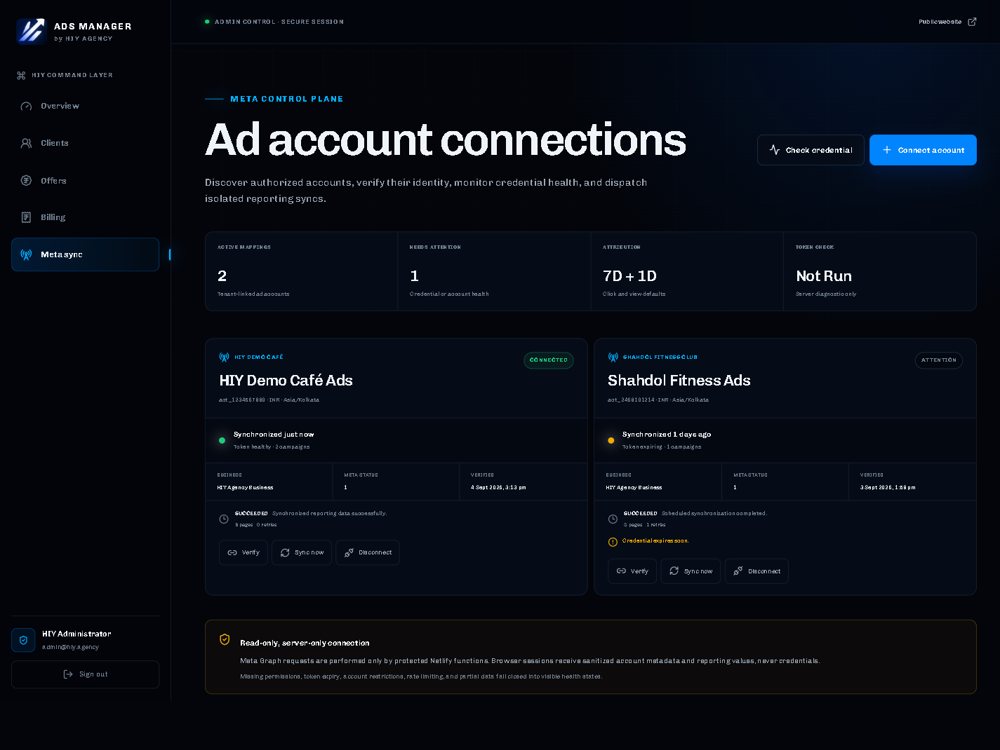
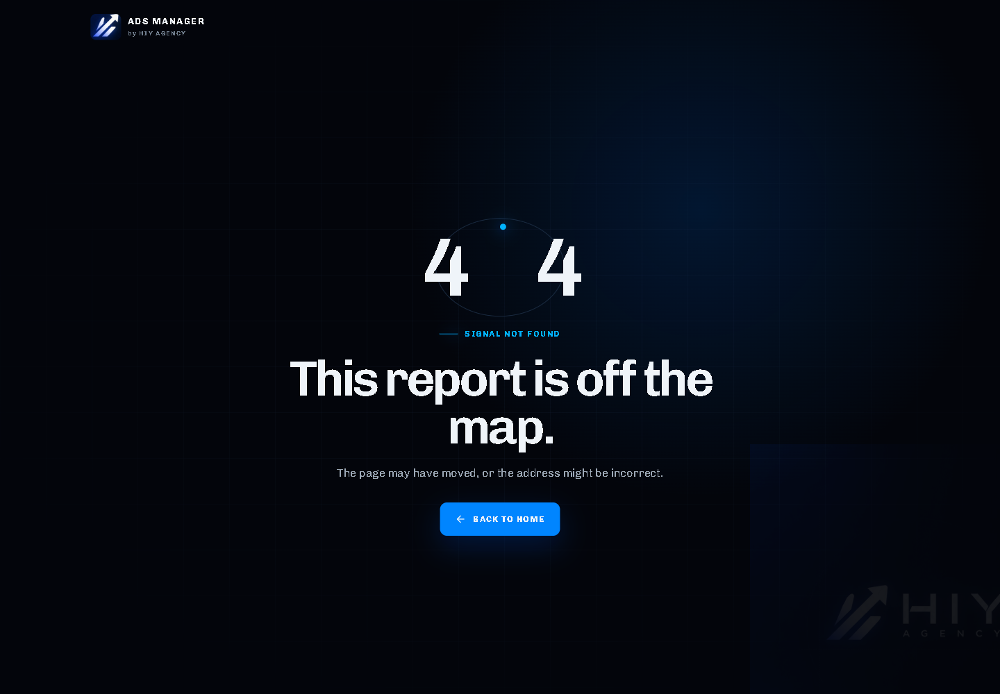

# AI Ads Manager — What Is Built, What Is Left, and What Users Will See

Audit date: 4 September 2026

> The screenshots in this document use safe local demonstration data. They do not contain real clients, Supabase records, Meta accounts, or live advertising results. No external service was contacted while producing them.

## Simple project summary

The application is substantially built as local code. The public website, secure role model, HIY admin panels, offer and billing engine, client dashboard, Meta reporting integration, and six-hour synchronization worker all exist.

The main work left is to connect the correct accounts, apply and test the database, add production credentials, verify real Meta figures, deploy, and connect `ads.hiy.agency`.

## Current phase status

| Phase | Current status | What is still required |
|---|---|---|
| 1. Public website | Built locally | Final production browser and mobile smoke test |
| 2. Supabase and authentication | Schema, Auth flow, roles, and tenant RLS are built locally | Connect the correct project, apply migrations, run database tests, configure Auth and email |
| 3. HIY Admin | All planned admin panels are built locally | Verify invitations and all mutations against the hosted database |
| 4. Offers and pricing | Built locally | Verify the seven packages, custom offers, frozen assignments, and payment ledger against hosted PostgreSQL |
| 5. Client dashboard | Built locally | Verify tenant isolation and dashboard calculations with hosted client data |
| 6. Meta Marketing API | Built locally | Add real server credentials, connect one test ad account, and reconcile figures against Meta Ads Manager |
| 7. Automatic synchronization | Scheduler, background worker, locks, retries, logs, and upserts exist locally | Deploy and observe real six-hour synchronization jobs |
| 8. Production deployment | Not activated | Configure Supabase and Netlify, deploy a preview, complete production QA, monitoring, backups, and rollback preparation |
| 9. Production domain | Not started | Connect `ads.hiy.agency`, issue SSL, update redirect/callback URLs, and run final domain tests |

## What is already working in the code

- Public HIY landing page with the 28-day niche planning estimator.
- Twenty-five business niches and seven daily Meta budget levels.
- Separate authoritative 31-day commercial packages.
- Admin and client roles with protected routes.
- Tenant-level database security policies.
- Client creation, editing, enabling, disabling, login attachment, and secure invitation function.
- Standard and custom offers with publishing, duplication, editing, versioning, and archiving.
- Immutable client package assignments.
- Manual payment recording, outstanding balances, and auditable payment voiding.
- Client reporting for 7 days, 14 days, 28 days, this month, and lifetime.
- Campaign spend, reach, impressions, clicks, CTR, CPC, CPM, results, leads, messages, and supported video metrics.
- Meta account discovery, verification, credential health, disconnect, manual sync, rate-limit handling, and safe server-only token use.
- Six-hour synchronization dispatch, per-account isolation, incremental lookback, and sync history.
- Responsive layouts, loading states, empty states, error states, and branded 404 page.

## Required work before clients can use it

Complete these steps in order:

1. Create a safe source-control checkpoint. The current workspace has no tracked project baseline, so the full working project should be committed before production configuration begins.
2. Sign into the correct Supabase organization and select the real Ads Manager project.
3. Link the project and apply all six SQL migrations in timestamp order.
4. Run the pgTAP database tests, RLS isolation tests, and Supabase security/performance advisors.
5. Configure Supabase Site URL, redirect allowlist, invitation email, password recovery, SMTP, and disable unwanted public sign-up.
6. Create and promote the first real HIY administrator.
7. Deploy a Netlify preview with the required browser-safe and server-only environment variables.
8. Test the complete admin workflow against hosted data: create client, invite login, assign offer, record payment, connect Meta, and synchronize.
9. Add the real HIY Meta system-user reporting token and app-access token only to the server environment.
10. Connect one controlled Meta ad account and compare spend, dates, campaigns, attribution, and results with Meta Ads Manager.
11. Enable the six-hour schedule only after the manual comparison is correct. Observe retries, expiry warnings, logs, and multi-client isolation.
12. Complete deploy-preview QA on desktop and mobile, including login, redirects, every panel, empty/error states, console errors, and security headers.
13. Enable backups and monitoring, document privacy/retention, and confirm rollback procedures.
14. Publish production, connect the Hostinger `ads` CNAME to Netlify, verify SSL, and update Supabase and Meta callbacks for `https://ads.hiy.agency`.

## Expected final output

### Public visitor

A branded website where a prospect can explore chart-based enquiry estimates, select a niche and Meta budget, understand GST/service/creative costs, and then proceed to the secure login page.

### Client

Each client receives an isolated account. After login, they see only their own:

- active package and exact frozen price;
- amount paid and outstanding;
- Meta advertising allocation, spend, remaining budget, and utilization;
- reporting freshness;
- campaign outcomes for selectable time periods;
- campaign-level spend, results, cost per result, CTR, and status;
- complete commercial breakdown.

### HIY administrator

You receive one command center for:

- client workspaces and login access;
- the complete offer catalogue;
- custom packages and immutable assignments;
- payment entry and outstanding balance tracking;
- Meta account mapping and credential health;
- manual synchronization and synchronization history.

### Background system

Every six hours, the deployed scheduler dispatches separate account jobs. Each job safely retrieves recent Meta campaigns and reporting data, updates records without duplicates, records diagnostics, and prevents one failed client from blocking the others.

## Features intentionally not included

These require a separate decision and are not blockers for the planned first release:

- online payment gateway;
- public self-registration;
- OAuth/social login;
- campaign creation or editing inside this portal;
- automatic budget changes or AI campaign optimization;
- a native mobile application.

## Screen previews

### 1. Public website — what a visitor sees

Pricing explanation, enquiry estimator, performance preview, and client login entry.

### 2. Login — what clients and HIY staff use

One secure entry point. The application sends each authenticated role to the correct workspace.

### 3. Client dashboard — what the customer sees

The customer sees only their own commercial package, payments, budget, campaign performance, and reporting freshness.

### 4. Admin overview — what you see first

Your opening command-center summary: active clients, offers, package coverage, outstanding payments, client pulse, and rollout status.

### 5. Admin clients

Create and manage client workspaces, packages, contacts, status, attached users, and secure invitations.

### 6. Admin offers

Manage the seven 31-day packages and future custom/private offers with exact commercial breakdowns.

### 7. Admin billing

Assign frozen packages, record payments, view balances, preserve agreement history, and void incorrect payment entries.

### 8. Admin Meta sync

Connect client ad accounts, verify mappings, check credential health, start synchronization, and see account warnings.

### 9. Branded 404

Unknown URLs receive a consistent recovery page instead of a blank screen.

## Final definition of done

The project is production-ready when the hosted database tests pass, real admin and client accounts work, one Meta account is reconciled against Meta Ads Manager, scheduled jobs remain healthy, every role sees only authorized data, the production domain has valid HTTPS, and final desktop/mobile QA reports no broken routes, console errors, or horizontal overflow.
